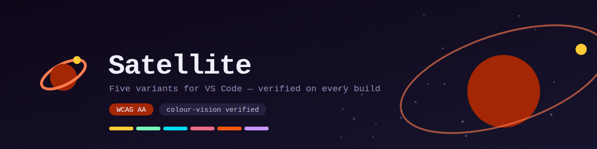
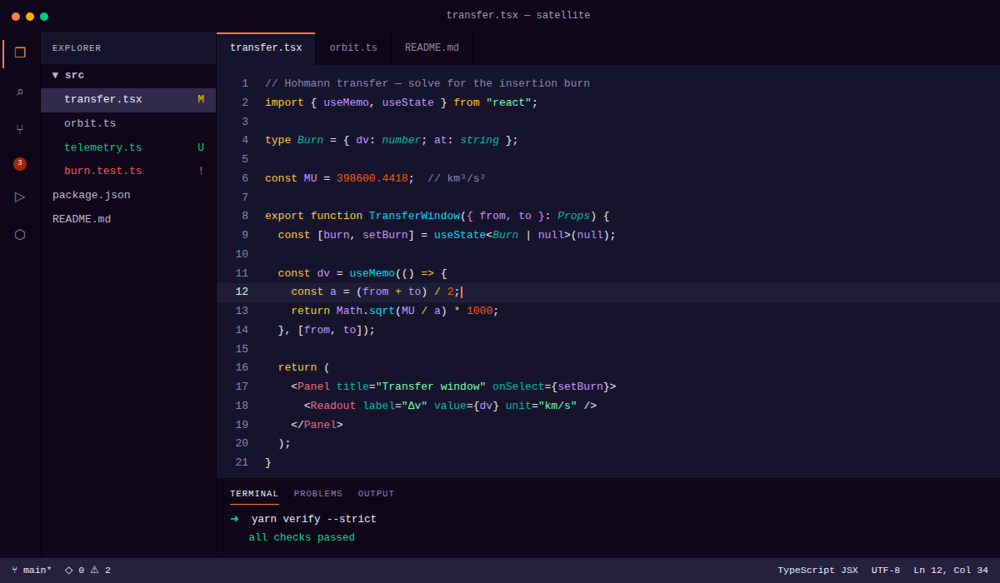
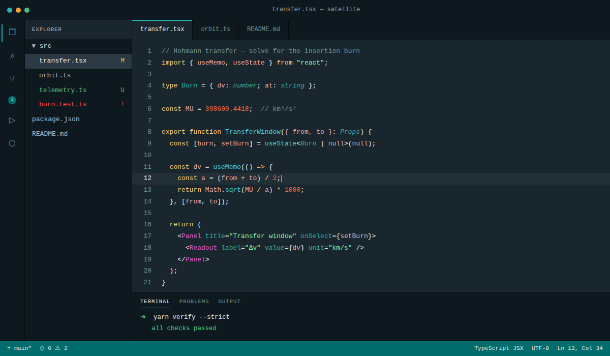
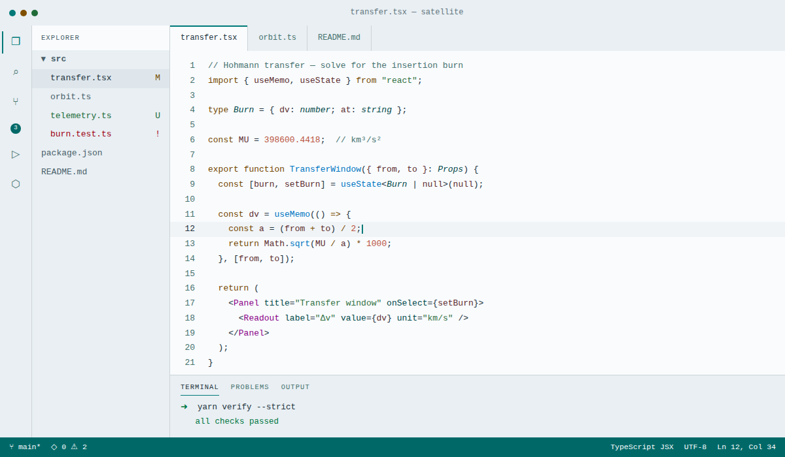
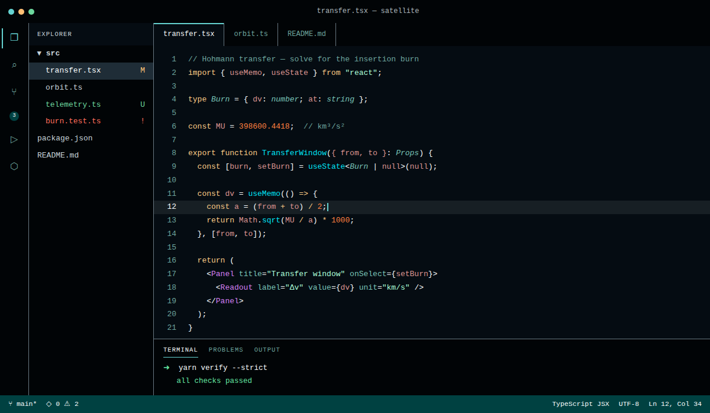
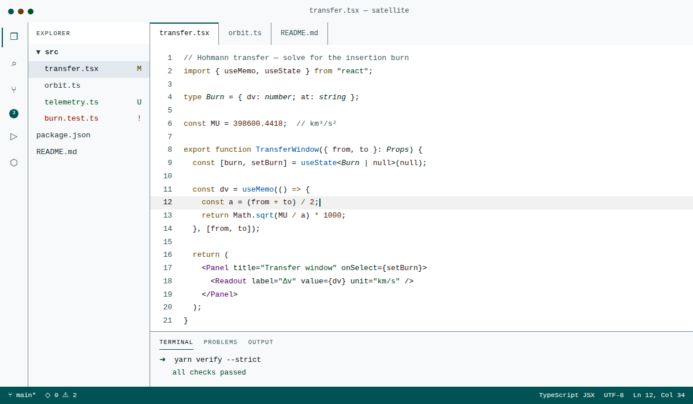
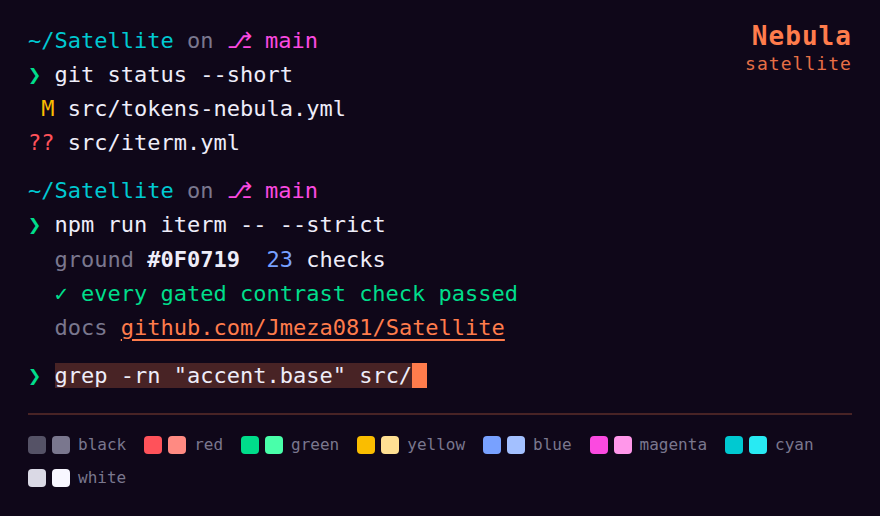

<p align="center">
  
</p>

<p align="center">
  A space-inspired theme for VS Code — neon on a violet ground, with dark, light<br>
  and high-contrast companions. Every colour is verified against WCAG&nbsp;2.2 and
  colour-vision simulation on every build.
</p>

---

## Satellite Nebula

<p align="center">
  
</p>

The theme to start with. Every surface sits on one short violet arc and is
separated by lightness rather than hue, and the ground runs dark on purpose:
neon is a contrast effect before it is a saturation one, so a dark ground is
what lets the syntax roles sit at the edge of sRGB and still clear WCAG AA.

Blood orange is the accent — cursor, focus ring, links, selection. Not the
status bar: that rests on a violet surface and only turns orange when a debug
session is running, so the loudest colour on screen means something is happening.
Gold is the second highlight, on keywords and warnings. The remaining roles are
cool, which is a constraint rather than a preference: the warm band holds three
roles and no more, because orange and gold collapse toward the same yellow for a
reader with protanopia or deuteranopia.

| | Colour | |
| --- | --- | --- |
| Editor | `#16142D` | violet ground |
| Chrome | `#0F0719` | activity bar, side bar, panel |
| Accent | `#FF7C4C` | blood orange |
| Keywords | `#FFCB36` | gold |
| Strings | `#76FFB7` | mint |
| Functions | `#00DDF4` | cyan |
| Identifiers | `#C896FF` | lilac |
| Tags | `#EC6B85` | dusty rose |

## The other variants

Five in total, all built from one set of partials — the workbench, syntax and
semantic rules are shared, and only the palette differs.

| Theme | Ground | Contrast floor |
| --- | --- | --- |
| **Satellite Nebula** | dark `#16142D` | WCAG AA |
| **Satellite** | dark `#1A262E` | WCAG AA |
| **Satellite Daybreak** | light `#F9FBFD` | WCAG AA |
| **Satellite High Contrast** | dark `#050C12` | WCAG AAA, no decorative exemptions |
| **Satellite Daybreak High Contrast** | white | WCAG AAA, no decorative exemptions |

Pick one from **Preferences: Color Theme** (`Ctrl/Cmd` `K` then `Ctrl/Cmd` `T`).

<details>
<summary><b>Satellite</b> — the original dark theme, a teal accent on a slate ground</summary>
<br>

</details>

<details>
<summary><b>Satellite Daybreak</b> — the light theme. Not an inversion: hues are held, chroma rises</summary>
<br>

</details>

<details>
<summary><b>Satellite High Contrast</b> — AAA, with the decorative exemptions withdrawn</summary>
<br>

</details>

<details>
<summary><b>Satellite Daybreak High Contrast</b> — the same bar, on white</summary>
<br>

</details>

Every capture above renders the same file, and all of them are generated by
`yarn screenshots` rather than taken by hand — the syntax is resolved through
the same scope matcher `yarn fixtures` uses, so a README image that disagrees
with the theme shows up as a diff instead of going quietly stale.

## Accessibility

Checked on every build, not asserted in a README.

- **Every text role clears WCAG AA** against the surface it actually sits on.
  That includes comments, which earlier versions of this theme rendered at
  2.39:1 — close to the point of invisibility for many readers.
- **Every pair of token colours that appears adjacent in real code stays
  distinguishable** under protanopia, deuteranopia and tritanopia. Roughly 1 in
  12 men has some form of colour vision deficiency, and under it hue differences
  collapse while lightness differences survive — so roles here are separated by
  lightness, not by hue alone.
- **The high-contrast variants clear AAA**, with the decorative exemptions
  withdrawn, so indent guides and rulers have to meet 3:1 as well.

`yarn verify` runs 419 contrast and colour-vision checks across the five themes
and fails the build on any regression. The requirements live in
[`src/a11y.yml`](./src/a11y.yml), declared separately from the code that
enforces them, so they can be reviewed on their own.

One documented exception: ANSI black on a dark terminal ground — and its mirror,
ANSI bright white on a light one — cannot reach AA without ceasing to be black
or white. Both are held to a lower floor of 2.5:1, which is where the colour is
unambiguously visible. The reasoning is written into `src/a11y.yml`.

## Supported languages

Two layers do the work. Languages with a language server are coloured by
**semantic tokens** — the compiler's own answer for what each identifier is,
rather than the grammar's guess — which covers TypeScript, JavaScript, Go, Rust,
C#, Java and Python from one set of rules. Everything else falls back to
TextMate scopes.

| Family | Languages |
| --- | --- |
| Core web | TypeScript, JavaScript, TSX, JSX, HTML, CSS |
| Frameworks | Vue SFC, Svelte, Astro |
| Styling | SCSS, Less, Tailwind, CSS-in-JS |
| Data and schema | JSON, YAML, TOML, GraphQL, Prisma |
| Server | Python, Go, Rust, PHP, Ruby, SQL |
| Prose and config | Markdown, Shell, Dockerfile, Makefile, diffs |

Coverage is asserted rather than claimed: [`src/fixtures.yml`](./src/fixtures.yml)
lists scope stacks the real grammars emit, and `yarn fixtures` checks that each
one resolves to the intended colour, with the intended font style, at readable
contrast. The fixtures verify how the theme handles a scope, not that a grammar
emits it; scope names are taken from each language's published grammar and the
sources are listed at the top of that file.

## Satellite for Slack

The two dark palettes are also published as Slack sidebar themes, built from the
same `src/tokens-*.yml` through the same resolver — so the Slack column and the
VS Code side bar are the same colour to the byte, and a palette change moves
both.

<p align="center">
  
  &nbsp;&nbsp;&nbsp;
  
</p>

**Satellite Nebula**

```
#0F0719,#322B4D,#FF7C4C,#0F0719,#24203E,#BAB8CC,#00E18E,#A32605
```

**Satellite**

```
#0E191F,#2A3943,#2DB4B2,#0E191F,#233039,#ACBAC0,#50D492,#006C6B
```

Open **Preferences → Themes**, set **Appearance** to **Dark**, then paste the
string into **Create a custom theme**. The Appearance step is not optional and
is not part of the string: a Slack custom theme colours the sidebar only, and
the message pane follows that setting — skipping it leaves a dark column beside
a white pane, which is the usual reason a dark Slack theme looks broken.

To share one, paste the string into any channel or DM and send it. Slack
recognises the format, renders the swatches inline, and gives everyone who can
see the message a **Switch sidebar theme** button — nothing is installed and no
app is authorised.

Eight colours is the entire surface area Slack exposes, so the work is in which
token goes in which slot. The reasoning is written next to each value in
[`src/slack.yml`](./src/slack.yml), and the same contrast contract applies:
`yarn slack:strict` re-measures every text and non-text pair against the
thresholds in `src/a11y.yml` and fails the build on a regression. Full tables
are in [`slack/README.md`](./slack/README.md), which is generated so the strings
in the prose cannot drift from the build.

Two slots depart from the editor mapping, and both look like mistakes until you
try the alternative:

- **The active channel takes the accent**, where VS Code's selected row takes a
  raised surface. VS Code draws a focus outline and Slack does not, so here the
  colour carries the whole affordance: `surface.overlay` measures 1.5:1 against
  the column, the accent measures 7:1.
- **The mention badge takes the deep accent, not the error red.** Slack always
  draws the count in white with no way to change it, and the error red holds
  white at 3.2:1 — a loud pill with an unreadable number.

## Satellite for iTerm2

All five palettes as iTerm2 colour schemes, in [`iterm/`](./iterm). The sixteen
ANSI colours are the same values `src/ui.yml` gives VS Code's integrated
terminal, so a shell prints identically in both.

<p align="center">
  
</p>

| Scheme | Ground | |
| --- | --- | --- |
| **Satellite Nebula** | `#0F0719` | [`satellite-nebula.itermcolors`](./iterm/satellite-nebula.itermcolors) |
| **Satellite** | `#0E191F` | [`satellite.itermcolors`](./iterm/satellite.itermcolors) |
| **Satellite Daybreak** | `#E9EFF3` | [`satellite-daybreak.itermcolors`](./iterm/satellite-daybreak.itermcolors) |
| **Satellite High Contrast** | `#010406` | [`satellite-orbit-hc.itermcolors`](./iterm/satellite-orbit-hc.itermcolors) |
| **Satellite Daybreak High Contrast** | `#F7F9FA` | [`satellite-daybreak-hc.itermcolors`](./iterm/satellite-daybreak-hc.itermcolors) |

Double-click the file to import it, then pick it from **Settings → Profiles →
Colors → Color Presets…**. Presets apply per profile, so a profile you use for
something else keeps its own colours. Sharing is just sending the file.

All five export here, where only the two dark palettes export to Slack. The
difference is that a terminal scheme sets its own ground: it cannot end up
paired with a surface it was not graded against, so the light and
high-contrast variants are as valid in a terminal as the dark ones.

The map is [`src/iterm.yml`](./src/iterm.yml), and `yarn iterm:strict` runs 23
contrast checks per scheme against the thresholds in `src/a11y.yml`. Full
tables and previews for each are in [`iterm/README.md`](./iterm/README.md).
Three decisions worth calling out:

- **Bold text takes the body colour, not a brighter one.** The obvious value is
  the bright-white corner of the ANSI cube, which lifts bold on a dark ground —
  and on Daybreak makes bold render *paler* than body text. Bold is carried by
  weight.
- **The badge is opaque.** iTerm's own badge is translucent and the first draft
  followed it, measuring between 2.4:1 and 4.5:1 depending on the palette. The
  alpha bought nothing — badge glyphs cover the same area either way — so it
  went, and the slot now clears AA everywhere.
- **`Tab Color` is deliberately unset**, because iTerm only honours it when a
  profile ticks *Use tab color*, and a scheme that silently repaints the tab bar
  is one people have to undo by hand.

One documented shortfall, inherited from the palettes rather than introduced
here: the corner of the ANSI cube nearest the ground — black on the dark
schemes, bright white on the light ones — sits below AA at the `dim` floor
described under [Accessibility](#accessibility). It cannot reach 4.5:1 without
ceasing to be the colour it names.

## Installing without the Marketplace

### From a `.vsix` — nothing to clone

The `.vsix` is a single ~64 KB file containing all five themes. Anyone can
install it without cloning the repository or waiting for a Marketplace listing.

Grab one from the [Releases](https://github.com/Jmeza081/Satellite/releases)
page, or from the artefacts of any [build run](https://github.com/Jmeza081/Satellite/actions)
if you want to try a branch. Then:

```bash
code --install-extension theme-satellite-*.vsix
```

Or inside VS Code: **Extensions** view → `...` menu → **Install from VSIX…**.
Restart, then pick a theme with `Ctrl/Cmd` `K` then `Ctrl/Cmd` `T`.

To remove it: `code --uninstall-extension theme-satellite`.

To build one yourself:

```bash
yarn install
yarn package        # -> bin/theme-satellite-<version>.vsix
```

Packaging runs the full gate first, so a theme that fails contrast or coverage
checks cannot be packaged at all.

### From source

For working on the theme rather than using it:

```bash
git clone https://github.com/Jmeza081/Satellite.git
cd Satellite
yarn install
yarn build
```

Then either press **F5** for an Extension Development Host, or symlink the
checkout into your extensions folder so edits are live:

```bash
ln -s "$(pwd)" ~/.vscode/extensions/theme-satellite
```

`theme/` is generated and gitignored, so `yarn build` is required before
VS Code can load the themes. Restart VS Code after symlinking.

## Development

The theme is authored as YAML partials under `src/` and compiled into `theme/`,
which is generated and not committed.

```
src/tokens-nebula.yml    the Nebula palette — the theme the extension leads with
src/tokens.yml           the original dark palette
src/tokens-daybreak.yml  the light palette
src/tokens-*-hc.yml      the high-contrast palettes
src/ui.yml               VS Code workbench colour keys
src/syntax.yml           TextMate syntax rules
src/semantic.yml         semantic token colours
src/a11y.yml             the accessibility contract that `yarn verify` enforces
src/fixtures.yml         per-language scope expectations `yarn fixtures` checks
src/slack.yml            the Slack sidebar slot map and its contrast contract
src/iterm.yml            the iTerm2 slot map and its contrast contract
src/themes.yml           which variants to build, and where else they export
```

The Slack and iTerm exports are generated into `slack/` and `iterm/`, which
*are* committed — the paste strings and the `.itermcolors` files are the
product, so they need to be usable without a build. Both go through
`scripts/export.js`, which holds the parts they share: reading the thresholds
out of `a11y.yml`, measuring a declared pair list, and refusing to let a
generated file or a hand-quoted README value drift from `src/`.

Colours are authored in OKLCH — `oklch(<lightness> <chroma> <hue>)` — and
converted to hex at build time, with chroma reduced automatically when a colour
falls outside sRGB. `alpha(token, A6)` appends a hex alpha byte, matching VS
Code's own `#RRGGBBAA` format. Nothing outside a palette file may contain a
literal hex value, so a palette change is a change to one file.

OKLCH is used because it is perceptually uniform: a lightness step means the
same thing on gold as it does on teal. That is what allows lightness to be the
channel that keeps token roles apart.

```bash
yarn build       # compile src/ into theme/
yarn dev         # rebuild on every change
yarn validate    # check colour keys against the VS Code reference
yarn coverage    # ... and list which key groups are still unstyled
yarn verify      # contrast and colour-vision separation — fails on regression
yarn fixtures    # per-language scope coverage
yarn brand       # regenerate assets/*.svg from the palettes
yarn assets      # re-render assets/*.svg to PNG
yarn screenshots # recapture the README editor mock-ups, one per theme
yarn slack       # rebuild slack/ and report its contrast
yarn slack:check # assert the committed slack/ files match src/
yarn slack:preview # re-render the Slack sidebar mock-ups
yarn iterm       # rebuild iterm/ and report its contrast
yarn iterm:check # assert the committed iterm/ files match src/
yarn iterm:preview # re-render the terminal mock-ups
yarn package     # build an installable .vsix into bin/
yarn test        # unit tests, then all of the above
```

`yarn verify:report` prints the full table — every colour's WCAG ratio and APCA
Lc, and the ΔE for each adjacency pair under all three simulations — without
failing the build. It is the tool to reach for when changing a palette.

`yarn validate` checks against [`data/vscode-color-keys.json`](./data/vscode-color-keys.json),
a committed snapshot of the VS Code colour reference. Refresh it with
`yarn update-color-keys` — the only command that needs network access.

## Contributing

Please read the [contributing guidelines](./.github/CONTRIBUTING.md).

## Licence

[MIT](./Licenses/SATELLITE%20LICENSE). The syntax rules began life as a fork of
[Dracula](https://github.com/dracula/visual-studio-code), whose licence is kept
alongside at [`Licenses/DRACULA LICENSE`](./Licenses/DRACULA%20LICENSE).
