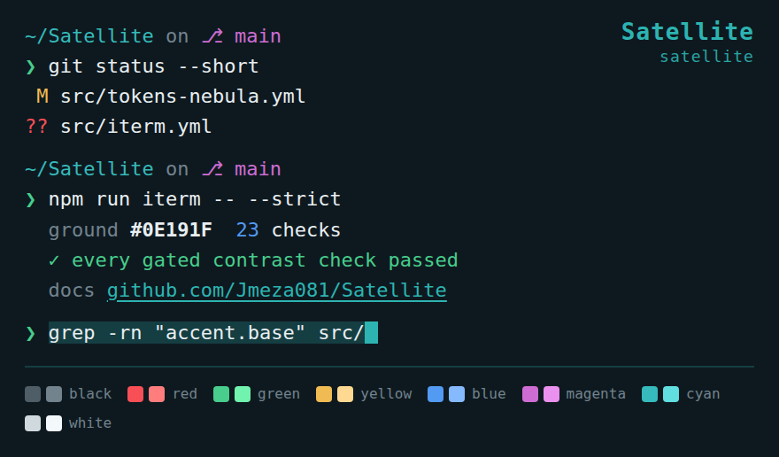
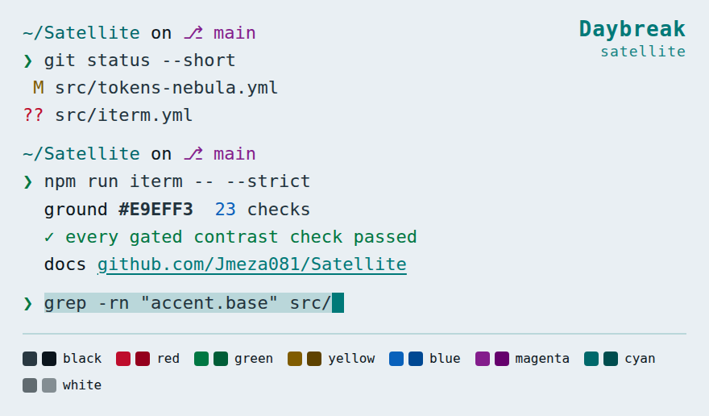
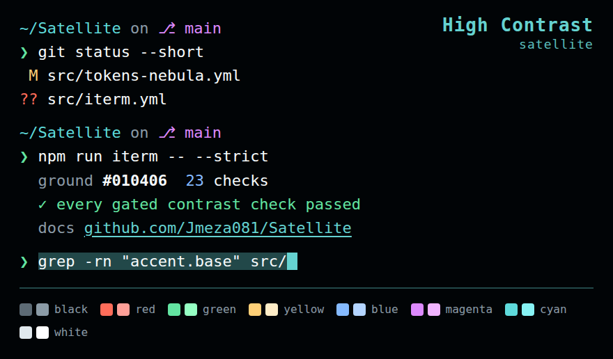
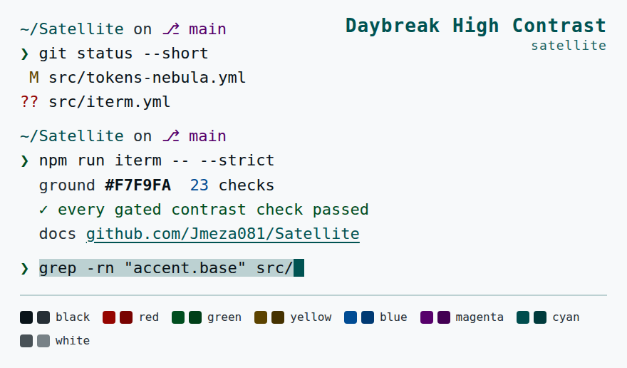

# Satellite for iTerm2

<!-- Generated by scripts/iterm.js. Edit src/iterm.yml, not this file. -->

All five Satellite palettes as iTerm2 colour schemes. The sixteen ANSI colours
are the same values `src/ui.yml` gives to VS Code's integrated terminal, so a
shell prints identically in both.

<p align="center">
  
</p>

## Installing

1. Download the `.itermcolors` file you want, or clone this repository.
2. Double-click it. iTerm2 imports it as a colour preset — nothing changes yet.
3. Open **Settings → Profiles → Colors**, then pick the scheme from the
   **Color Presets…** menu at the bottom right.

Presets apply per profile, not globally, so a profile you use for something
else keeps its own colours. To make it the default, apply it to the profile
marked *Default* in the profile list.

Importing does not overwrite a preset of the same name from a previous
version — iTerm keeps both and appends a number. Delete the old one from
**Color Presets… → Delete Preset** if you are updating.

## Sharing

The `.itermcolors` file is the whole scheme; send it as a file and the
recipient double-clicks it. There is nothing to install and no preferences are
read or written until they pick the preset.

## Satellite

[`satellite.itermcolors`](./satellite.itermcolors) — built from `src/tokens.yml`



| | Normal | | Bright | |
| - | ------ | - | ------ | - |
| black | `#4F5D67` | 0 | `#72838E` | 8 |
| red | `#F84F57` | 1 | `#FF7D7D` | 9 |
| green | `#48CD8C` | 2 | `#71F2AE` | 10 |
| yellow | `#F0BB52` | 3 | `#FFD891` | 11 |
| blue | `#539AF2` | 4 | `#85BAFF` | 12 |
| magenta | `#CD6DD3` | 5 | `#EA91EF` | 13 |
| cyan | `#36BABB` | 6 | `#61DEDF` | 14 |
| white | `#D0D9DE` | 7 | `#F3F8FA` | 15 |

| Slot | Colour | Token |
| ---- | ------ | ----- |
| Background Color | `#0E191F` | `surface.deep` |
| Foreground Color | `#E8EEF1` | `text.default` |
| Bold Color | `#E8EEF1` | `text.default` |
| Cursor Color | `#2DB4B2` | `accent.base` |
| Cursor Text Color | `#0E191F` | `text.onFill` |
| Cursor Guide Color | `#2DB4B226` | `alpha(accent.base, 26)` |
| Selection Color | `#2DB4B23D` | `wash.selection` |
| Selected Text Color | `#E8EEF1` | `text.default` |
| Link Color | `#2DB4B2` | `accent.base` |
| Underline Color | `#2DB4B2` | `accent.base` |
| Badge Color | `#2DB4B2` | `accent.base` |

<details>
<summary>Contrast</summary>

| Pair | Ratio | Required | |
| ---- | ----- | -------- | - |
| terminal text | 15.23:1 | 4.5 | ✓ |
| bold text | 15.23:1 | 4.5 | ✓ |
| links | 7.03:1 | 4.5 | ✓ |
| text inside a selection | 9.96:1 | 4.5 | ✓ |
| text under the block cursor | 7.03:1 | 4.5 | ✓ |
| the cursor against the ground | 7.03:1 | 3.0 | ✓ |
| ansi red | 5.31:1 | 4.5 | ✓ |
| ansi green | 8.82:1 | 4.5 | ✓ |
| ansi yellow | 10.14:1 | 4.5 | ✓ |
| ansi blue | 6.18:1 | 4.5 | ✓ |
| ansi magenta | 5.71:1 | 4.5 | ✓ |
| ansi cyan | 7.56:1 | 4.5 | ✓ |
| ansi white | 12.45:1 | 4.5 | ✓ |
| ansi bright black | 4.55:1 | 4.5 | ✓ |
| ansi bright red | 7.20:1 | 4.5 | ✓ |
| ansi bright green | 12.75:1 | 4.5 | ✓ |
| ansi bright yellow | 13.15:1 | 4.5 | ✓ |
| ansi bright blue | 8.89:1 | 4.5 | ✓ |
| ansi bright magenta | 8.32:1 | 4.5 | ✓ |
| ansi bright cyan | 11.06:1 | 4.5 | ✓ |
| ansi black | 2.63:1 | 2.5 | ✓ |
| ansi bright white | 16.66:1 | 2.5 | ✓ |
| badge text | 7.03:1 | 4.5 | ✓ |

</details>

## Satellite Nebula

[`satellite-nebula.itermcolors`](./satellite-nebula.itermcolors) — built from `src/tokens-nebula.yml`


| | Normal | | Bright | |
| - | ------ | - | ------ | - |
| black | `#555266` | 0 | `#7A778E` | 8 |
| red | `#FF525A` | 1 | `#FF8A82` | 9 |
| green | `#00DD8B` | 2 | `#49FFAA` | 10 |
| yellow | `#FABD00` | 3 | `#FFE093` | 11 |
| blue | `#78A1FF` | 4 | `#A3C0FF` | 12 |
| magenta | `#FB4AE0` | 5 | `#FF97EA` | 13 |
| cyan | `#00C9D1` | 6 | `#28EAF3` | 14 |
| white | `#DAD9E5` | 7 | `#F8F7FF` | 15 |

| Slot | Colour | Token |
| ---- | ------ | ----- |
| Background Color | `#0F0719` | `surface.deep` |
| Foreground Color | `#EEEDF9` | `text.default` |
| Bold Color | `#EEEDF9` | `text.default` |
| Cursor Color | `#FF7C4C` | `accent.base` |
| Cursor Text Color | `#0F0719` | `text.onFill` |
| Cursor Guide Color | `#FF7C4C26` | `alpha(accent.base, 26)` |
| Selection Color | `#FF7C4C3D` | `wash.selection` |
| Selected Text Color | `#EEEDF9` | `text.default` |
| Link Color | `#FF7C4C` | `accent.base` |
| Underline Color | `#FF7C4C` | `accent.base` |
| Badge Color | `#FF7C4C` | `accent.base` |

<details>
<summary>Contrast</summary>

| Pair | Ratio | Required | |
| ---- | ----- | -------- | - |
| terminal text | 17.02:1 | 4.5 | ✓ |
| bold text | 17.02:1 | 4.5 | ✓ |
| links | 7.74:1 | 4.5 | ✓ |
| text inside a selection | 11.74:1 | 4.5 | ✓ |
| text under the block cursor | 7.74:1 | 4.5 | ✓ |
| the cursor against the ground | 7.74:1 | 3.0 | ✓ |
| ansi red | 6.20:1 | 4.5 | ✓ |
| ansi green | 11.00:1 | 4.5 | ✓ |
| ansi yellow | 11.59:1 | 4.5 | ✓ |
| ansi blue | 7.83:1 | 4.5 | ✓ |
| ansi magenta | 6.72:1 | 4.5 | ✓ |
| ansi cyan | 9.65:1 | 4.5 | ✓ |
| ansi white | 14.12:1 | 4.5 | ✓ |
| ansi bright black | 4.56:1 | 4.5 | ✓ |
| ansi bright red | 8.65:1 | 4.5 | ✓ |
| ansi bright green | 15.18:1 | 4.5 | ✓ |
| ansi bright yellow | 15.34:1 | 4.5 | ✓ |
| ansi bright blue | 10.84:1 | 4.5 | ✓ |
| ansi bright magenta | 10.21:1 | 4.5 | ✓ |
| ansi bright cyan | 13.29:1 | 4.5 | ✓ |
| ansi black | 2.62:1 | 2.5 | ✓ |
| ansi bright white | 18.54:1 | 2.5 | ✓ |
| badge text | 7.74:1 | 4.5 | ✓ |

</details>

## Satellite Daybreak

[`satellite-daybreak.itermcolors`](./satellite-daybreak.itermcolors) — built from `src/tokens-daybreak.yml`



| | Normal | | Bright | |
| - | ------ | - | ------ | - |
| black | `#293841` | 0 | `#0B151C` | 8 |
| red | `#BE0D2C` | 1 | `#94001D` | 9 |
| green | `#007742` | 2 | `#005D37` | 10 |
| yellow | `#805C00` | 3 | `#5E4200` | 11 |
| blue | `#0961BB` | 4 | `#004892` | 12 |
| magenta | `#841D8C` | 5 | `#65006C` | 13 |
| cyan | `#00686A` | 6 | `#004D4E` | 14 |
| white | `#616B70` | 7 | `#848E93` | 15 |

| Slot | Colour | Token |
| ---- | ------ | ----- |
| Background Color | `#E9EFF3` | `surface.deep` |
| Foreground Color | `#22333D` | `text.default` |
| Bold Color | `#22333D` | `text.default` |
| Cursor Color | `#007978` | `accent.base` |
| Cursor Text Color | `#F9FBFD` | `text.onFill` |
| Cursor Guide Color | `#00797826` | `alpha(accent.base, 26)` |
| Selection Color | `#00797833` | `wash.selection` |
| Selected Text Color | `#22333D` | `text.default` |
| Link Color | `#007978` | `accent.base` |
| Underline Color | `#007978` | `accent.base` |
| Badge Color | `#007978` | `accent.base` |

<details>
<summary>Contrast</summary>

| Pair | Ratio | Required | |
| ---- | ----- | -------- | - |
| terminal text | 11.25:1 | 4.5 | ✓ |
| bold text | 11.25:1 | 4.5 | ✓ |
| links | 4.52:1 | 4.5 | ✓ |
| text inside a selection | 8.59:1 | 4.5 | ✓ |
| text under the block cursor | 5.05:1 | 4.5 | ✓ |
| the cursor against the ground | 4.52:1 | 3.0 | ✓ |
| ansi red | 5.51:1 | 4.5 | ✓ |
| ansi green | 4.87:1 | 4.5 | ✓ |
| ansi yellow | 5.25:1 | 4.5 | ✓ |
| ansi blue | 5.26:1 | 4.5 | ✓ |
| ansi magenta | 7.14:1 | 4.5 | ✓ |
| ansi cyan | 5.68:1 | 4.5 | ✓ |
| ansi white | 4.71:1 | 4.5 | ✓ |
| ansi bright black | 15.91:1 | 4.5 | ✓ |
| ansi bright red | 7.95:1 | 4.5 | ✓ |
| ansi bright green | 6.91:1 | 4.5 | ✓ |
| ansi bright yellow | 8.03:1 | 4.5 | ✓ |
| ansi bright blue | 7.73:1 | 4.5 | ✓ |
| ansi bright magenta | 10.23:1 | 4.5 | ✓ |
| ansi bright cyan | 8.34:1 | 4.5 | ✓ |
| ansi black | 10.43:1 | 2.5 | ✓ |
| ansi bright white | 2.89:1 | 2.5 | ✓ |
| badge text | 4.52:1 | 4.5 | ✓ |

</details>

## Satellite High Contrast

[`satellite-orbit-hc.itermcolors`](./satellite-orbit-hc.itermcolors) — built from `src/tokens-orbit-hc.yml`



| | Normal | | Bright | |
| - | ------ | - | ------ | - |
| black | `#5D6B75` | 0 | `#8B9BA6` | 8 |
| red | `#FF6D5A` | 1 | `#FFA098` | 9 |
| green | `#63E4A1` | 2 | `#95FFC3` | 10 |
| yellow | `#FFD077` | 3 | `#FFEDC7` | 11 |
| blue | `#85BAFF` | 4 | `#B3D4FF` | 12 |
| magenta | `#DD89FD` | 5 | `#F1B4FF` | 13 |
| cyan | `#5EDADB` | 6 | `#87F3F4` | 14 |
| white | `#E1E9ED` | 7 | `#FFFFFF` | 15 |

| Slot | Colour | Token |
| ---- | ------ | ----- |
| Background Color | `#010406` | `surface.deep` |
| Foreground Color | `#F7FBFC` | `text.default` |
| Bold Color | `#F7FBFC` | `text.default` |
| Cursor Color | `#65D2D0` | `accent.base` |
| Cursor Text Color | `#050C12` | `text.onFill` |
| Cursor Guide Color | `#65D2D026` | `alpha(accent.base, 26)` |
| Selection Color | `#65D2D055` | `wash.selection` |
| Selected Text Color | `#F7FBFC` | `text.default` |
| Link Color | `#65D2D0` | `accent.base` |
| Underline Color | `#65D2D0` | `accent.base` |
| Badge Color | `#65D2D0` | `accent.base` |

<details>
<summary>Contrast</summary>

| Pair | Ratio | Required | |
| ---- | ----- | -------- | - |
| terminal text | 19.74:1 | 4.5 | ✓ |
| bold text | 19.74:1 | 4.5 | ✓ |
| links | 11.44:1 | 4.5 | ✓ |
| text inside a selection | 9.52:1 | 4.5 | ✓ |
| text under the block cursor | 10.94:1 | 4.5 | ✓ |
| the cursor against the ground | 11.44:1 | 3.0 | ✓ |
| ansi red | 7.43:1 | 4.5 | ✓ |
| ansi green | 12.87:1 | 4.5 | ✓ |
| ansi yellow | 14.24:1 | 4.5 | ✓ |
| ansi blue | 10.25:1 | 4.5 | ✓ |
| ansi magenta | 8.88:1 | 4.5 | ✓ |
| ansi cyan | 12.27:1 | 4.5 | ✓ |
| ansi white | 16.72:1 | 4.5 | ✓ |
| ansi bright black | 7.18:1 | 4.5 | ✓ |
| ansi bright red | 10.51:1 | 4.5 | ✓ |
| ansi bright green | 17.01:1 | 4.5 | ✓ |
| ansi bright yellow | 17.81:1 | 4.5 | ✓ |
| ansi bright blue | 13.49:1 | 4.5 | ✓ |
| ansi bright magenta | 12.45:1 | 4.5 | ✓ |
| ansi bright cyan | 15.82:1 | 4.5 | ✓ |
| ansi black | 3.75:1 | 2.5 | ✓ |
| ansi bright white | 20.56:1 | 2.5 | ✓ |
| badge text | 11.44:1 | 4.5 | ✓ |

</details>

## Satellite Daybreak High Contrast

[`satellite-daybreak-hc.itermcolors`](./satellite-daybreak-hc.itermcolors) — built from `src/tokens-daybreak-hc.yml`



| | Normal | | Bright | |
| - | ------ | - | ------ | - |
| black | `#091319` | 0 | `#262F36` | 8 |
| red | `#950500` | 1 | `#780200` | 9 |
| green | `#004E1F` | 2 | `#003F18` | 10 |
| yellow | `#5C4300` | 3 | `#453200` | 11 |
| blue | `#004C94` | 4 | `#003A73` | 12 |
| magenta | `#57006B` | 5 | `#430053` | 13 |
| cyan | `#004D4E` | 6 | `#003B3C` | 14 |
| white | `#485156` | 7 | `#788287` | 15 |

| Slot | Colour | Token |
| ---- | ------ | ----- |
| Background Color | `#F7F9FA` | `surface.deep` |
| Foreground Color | `#091319` | `text.default` |
| Bold Color | `#091319` | `text.default` |
| Cursor Color | `#005352` | `accent.base` |
| Cursor Text Color | `#FFFFFF` | `text.onFill` |
| Cursor Guide Color | `#00535226` | `alpha(accent.base, 26)` |
| Selection Color | `#0053523D` | `wash.selection` |
| Selected Text Color | `#091319` | `text.default` |
| Link Color | `#005352` | `accent.base` |
| Underline Color | `#005352` | `accent.base` |
| Badge Color | `#005352` | `accent.base` |

<details>
<summary>Contrast</summary>

| Pair | Ratio | Required | |
| ---- | ----- | -------- | - |
| terminal text | 17.77:1 | 4.5 | ✓ |
| bold text | 17.77:1 | 4.5 | ✓ |
| links | 8.43:1 | 4.5 | ✓ |
| text inside a selection | 11.79:1 | 4.5 | ✓ |
| text under the block cursor | 8.90:1 | 4.5 | ✓ |
| the cursor against the ground | 8.43:1 | 3.0 | ✓ |
| ansi red | 8.65:1 | 4.5 | ✓ |
| ansi green | 9.43:1 | 4.5 | ✓ |
| ansi yellow | 8.81:1 | 4.5 | ✓ |
| ansi blue | 8.08:1 | 4.5 | ✓ |
| ansi magenta | 12.29:1 | 4.5 | ✓ |
| ansi cyan | 9.16:1 | 4.5 | ✓ |
| ansi white | 7.69:1 | 4.5 | ✓ |
| ansi bright black | 12.89:1 | 4.5 | ✓ |
| ansi bright red | 11.00:1 | 4.5 | ✓ |
| ansi bright green | 11.53:1 | 4.5 | ✓ |
| ansi bright yellow | 11.63:1 | 4.5 | ✓ |
| ansi bright blue | 10.73:1 | 4.5 | ✓ |
| ansi bright magenta | 14.58:1 | 4.5 | ✓ |
| ansi bright cyan | 11.76:1 | 4.5 | ✓ |
| ansi black | 17.77:1 | 2.5 | ✓ |
| ansi bright white | 3.72:1 | 2.5 | ✓ |
| badge text | 8.43:1 | 4.5 | ✓ |

</details>

## Notes on the map

The reasoning for each slot is in `src/iterm.yml`, next to the value. Three
are worth repeating:

- **Bold text takes the body colour, not a brighter one.** The obvious value is
  the bright-white corner of the cube, which lifts bold on a dark ground — and
  on the light palettes makes bold render *paler* than body text. Bold is
  carried by weight.

- **Selection is translucent**, as it is in the editor, so text under it stays
  legible instead of being replaced by a solid band. The contract measures the
  selected text over the composited result rather than over the raw wash.

- **`Tab Color` is deliberately unset.** iTerm only honours it when a profile
  ticks *Use tab color*, and a scheme that silently repaints the tab bar on
  import is one people have to undo by hand.

One shortfall is reported on every build rather than exempted: the corner of
the ANSI cube nearest the ground — black on the dark palettes, bright white on
the light ones — sits below AA at the documented `dim` floor in
`src/a11y.yml`. It cannot reach 4.5:1 without ceasing to be the colour it
names, and the 2019 palette this replaced had ANSI black at 1.08:1, where
anything printing in black printed nothing.

## Rebuilding

```sh
npm run iterm           # rebuild and report contrast
npm run iterm:strict    # rebuild and fail the build on a contract failure
npm run iterm:check     # assert the checked-in files match src/
```
