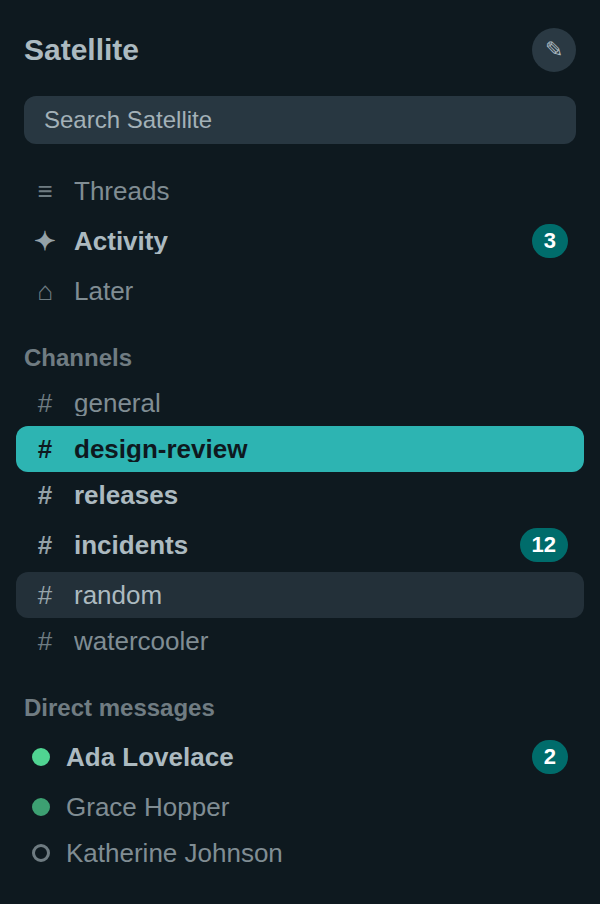
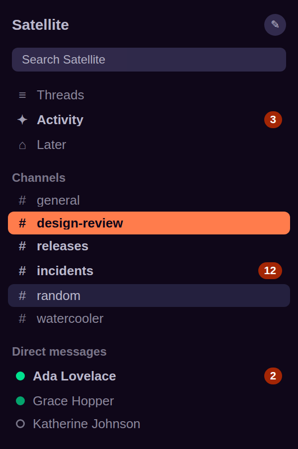

# Satellite for Slack

<!-- Generated by scripts/slack.js. Edit src/slack.yml, not this file. -->

Two of the Satellite palettes, projected onto Slack's eight sidebar colours.
The values come from the same `src/tokens-*.yml` the VS Code themes are built
from, resolved through the same code — so the Slack column and the editor side
bar are the same colour to the byte, and a palette change moves both.

## Installing

1. Open Slack → **Preferences** → **Themes**.
2. Set **Appearance** to **Dark**. This step is not optional and it is not part
   of the theme string: a custom theme colours the sidebar only, and the message
   pane follows this setting. Skipping it leaves a dark column beside a white
   pane, which is the usual reason a dark Slack theme looks broken.
3. Scroll to the bottom of the theme list and open **Create a custom theme**.
4. Paste the string for the theme you want into the box beneath the swatches.

Preferences are per-account, so this is applied once per workspace you are
signed in to. On iOS and Android the same box lives under
**You → Preferences → Dark Mode / Themes**.

## Sharing

Paste the string into any Slack channel or DM and send it. Slack recognises the
format, renders the eight swatches inline, and offers everyone who can see the
message a **Switch sidebar theme** button. Nothing is installed and no app is
authorised — the recipient's click writes the colours into their own
preferences, and they can revert from the same screen.

## Satellite



```
#0E191F,#2A3943,#2DB4B2,#0E191F,#233039,#ACBAC0,#50D492,#006C6B
```

| # | Slot | Colour | Token |
| - | ---- | ------ | ----- |
| 1 | Column BG | `#0E191F` | `surface.deep` |
| 2 | Menu BG Hover | `#2A3943` | `surface.overlay` |
| 3 | Active Item | `#2DB4B2` | `accent.base` |
| 4 | Active Item Text | `#0E191F` | `text.onFill` |
| 5 | Hover Item | `#233039` | `surface.raised` |
| 6 | Text Color | `#ACBAC0` | `text.muted` |
| 7 | Active Presence | `#50D492` | `status.success` |
| 8 | Mention Badge | `#006C6B` | `accent.solid` |

| Pair | Ratio | Required | |
| ---- | ----- | -------- | - |
| channel names at rest | 8.95:1 | 4.5 | ✓ |
| channel names under the pointer | 6.78:1 | 4.5 | ✓ |
| workspace menu and search field | 5.97:1 | 4.5 | ✓ |
| the channel you are in | 7.03:1 | 4.5 | ✓ |
| the mention count, which Slack always draws white | 6.25:1 | 4.5 | ✓ |
| the active channel against the column | 7.03:1 | 3.0 | ✓ |
| the online dot against the column | 9.49:1 | 3.0 | ✓ |
| Mention Badge on Column BG <sup>1</sup> | 2.85:1 | 3.0 (advisory) | — |

> **1.** The badge fill is quieter than 3:1 against the column because it is the one fill dark enough to hold Slack's white count at AA. The numeral carries the meaning and clears 15:1; a lighter pill would reverse that.

<br clear="right">

## Satellite Nebula



```
#0F0719,#322B4D,#FF7C4C,#0F0719,#24203E,#BAB8CC,#00E18E,#A32605
```

| # | Slot | Colour | Token |
| - | ---- | ------ | ----- |
| 1 | Column BG | `#0F0719` | `surface.deep` |
| 2 | Menu BG Hover | `#322B4D` | `surface.overlay` |
| 3 | Active Item | `#FF7C4C` | `accent.base` |
| 4 | Active Item Text | `#0F0719` | `text.onFill` |
| 5 | Hover Item | `#24203E` | `surface.raised` |
| 6 | Text Color | `#BAB8CC` | `text.muted` |
| 7 | Active Presence | `#00E18E` | `status.success` |
| 8 | Mention Badge | `#A32605` | `accent.solid` |

| Pair | Ratio | Required | |
| ---- | ----- | -------- | - |
| channel names at rest | 10.16:1 | 4.5 | ✓ |
| channel names under the pointer | 8.00:1 | 4.5 | ✓ |
| workspace menu and search field | 6.81:1 | 4.5 | ✓ |
| the channel you are in | 7.74:1 | 4.5 | ✓ |
| the mention count, which Slack always draws white | 7.40:1 | 4.5 | ✓ |
| the active channel against the column | 7.74:1 | 3.0 | ✓ |
| the online dot against the column | 11.42:1 | 3.0 | ✓ |
| Mention Badge on Column BG <sup>1</sup> | 2.66:1 | 3.0 (advisory) | — |

> **1.** The badge fill is quieter than 3:1 against the column because it is the one fill dark enough to hold Slack's white count at AA. The numeral carries the meaning and clears 15:1; a lighter pill would reverse that.

<br clear="right">

## Notes on the map

The reasoning for each slot is in `src/slack.yml`, next to the value. Two
decisions are worth repeating here, because both look like mistakes:

- **The active channel uses the accent, where the editor uses a raised
  surface.** VS Code draws a focus outline around the selected row and Slack
  does not, so the colour has to carry the whole affordance. `surface.overlay`
  measures 1.5:1 against the column; the accent measures 7:1.

- **The mention badge is the deep accent, not the error red.** Slack always
  draws the count in white and offers no way to change it. The error red holds
  white at 3.2:1, so the loud pill would carry an unreadable number.

## Rebuilding

```sh
npm run slack           # rebuild and report contrast
npm run slack:strict    # rebuild and fail the build on a contract failure
npm run slack:check     # assert the checked-in files match src/
```
